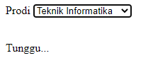

# Pertemuan 5
Tugas Praktikum Pemrogram Web Pertemuan 5

M Nuur Arinda M (120140145)

> Membuat aplikasi web yang dapat menampilkan data mahasiswa ketika pengguna melakukan
perubahan pada pilihan program studi yang tersedia menggunakan bantuan AJAX.
> - Aplikasi terhubung ke database yang memiliki tabel mahasiswa dengan minimal 3 data
yaitu NIM, Nama, dan Program Studi.
> - Terdapat minimal 10 baris data mahasiswa.

Data Tabel

Data yang saya buat berjumlah 10 data mahasiswa

Pertama Kali Dijalankan

Data yang terlihat masih kosong karena belum memilih *option* yang ada

Proses Loading 

Tampilan ini saya buat agar pergantian data yang dipilih akan terlihat jelas

Hasil akhir

Data yang terlihat akan sesuai dengan yang dipilih

