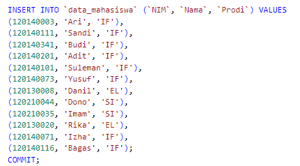

# Pertemuan 5
Tugas Praktikum Pemrogram Web Pertemuan 5

M Nuur Arinda M (120140145)

> Aplikasi web untuk menampilkan data-data mahasiswa berdasarkan prodi yang dipilih
> - Aplikasi terhubung ke database yang memiliki tabel mahasiswa dengan minimal 3 data
yaitu NIM, Nama, dan Program Studi.
> - Terdapat minimal 10 baris data mahasiswa.

Data Tabel

Terdapat 12 data mahasiswa dalam database

Pertama Kali Dijalankan

Belum ada data yang dapat dilihat karena belum ada prodi yang dipilih

Hasil akhir

Data yang terlihat setelah memilih prodi

